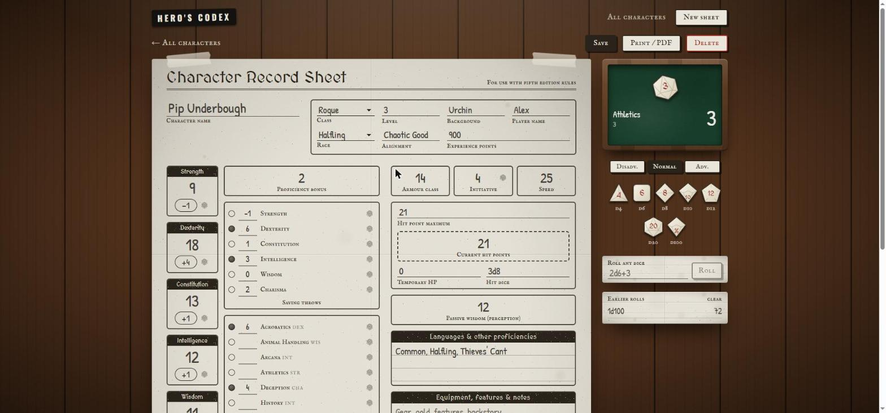
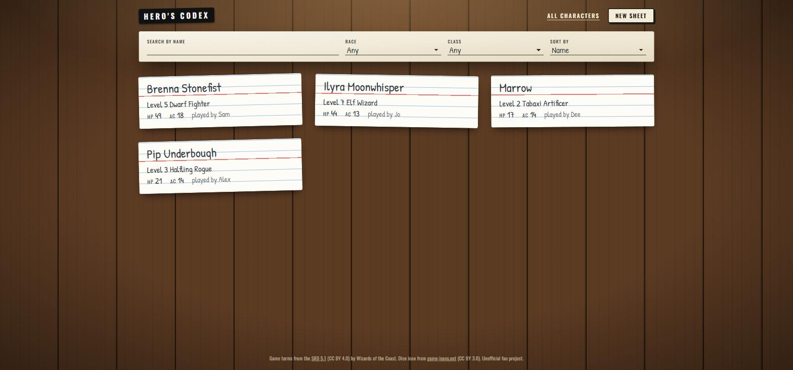
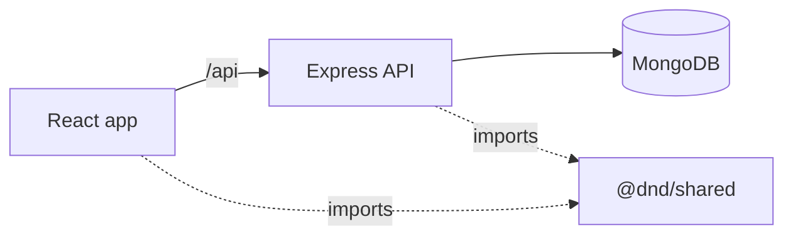

# Hero's Codex

An online D&D 5th Edition character sheet that looks and feels like filling in a paper one. You write your character's details straight onto the sheet, keep a pile of characters as index cards, roll dice from the sheet, and print it when you need a paper copy.

Built with React 19, Vite, Tailwind CSS 4, Express 5, MongoDB (Mongoose) and Vitest.

Live demo: coming soon (see [docs/DEPLOYMENT.md](docs/DEPLOYMENT.md)).



## Features

- A character sheet styled like a photocopied form on a basement table, with handwriting for everything you fill in.
- Every value is typed by the player. The only thing the app works out is each ability modifier, from the score you write.
- Race and class can be picked from the standard SRD 5.1 list or written in with "Other", so homebrew and non-SRD options work.
- Bonus boxes and proficiency bubbles for all six saving throws and 18 skills.
- A wooden dice tray: drag dice (d4 to d100) onto the felt, add a bonus, and press Roll. Dice can also be added by tapping or with the keyboard. The d20 next to each ability, save, skill and initiative sets up that check on the board with its bonus, and a single d20 can be rolled with advantage or disadvantage.
- Print stylesheet so "Print / PDF" produces a one-page A4 sheet.
- Character list as index cards, with search, race/class filters (including "Other") and sorting.
- Warns before you leave a sheet with unsaved changes.



## Running locally

Requires Node 20.19 or newer.

```bash
git clone https://github.com/CaitP02/dnd-character-project.git
cd dnd-character-project
cp backend/.env.example backend/.env
npm install
npm run dev
```

Open http://localhost:5173. The API runs on port 5555.

The example `.env` uses `MONGODB_URI=memory`, which starts a temporary in-memory MongoDB with four sample characters, so no database install is needed. Everything resets when you stop the server with Ctrl+C. To keep your characters, put a real MongoDB connection string (for example a free Atlas cluster) in `MONGODB_URI`.

## Project structure

```
shared/     Ability, skill, race and class lists, the modifier formula and dice functions (npm workspace @dnd/shared)
backend/    Express API and Mongoose model
frontend/   React app
docs/       Deployment guide and screenshots
```



## Design notes

**The sheet is the form.** There is no separate edit screen. `frontend/src/components/sheet/CharacterSheetForm.jsx` lays out the boxes, and `frontend/src/lib/sheet.js` converts between what's written in the boxes (text) and what the API stores (numbers, with `null` for an empty box). Those conversions are unit-tested.

**Blank is allowed.** Only the name is required. Every number can be left empty, just like a box on paper, and the API stores it as `null`.

**"Other" is just text.** Race and class are stored as plain strings. The picker offers the SRD list and switches to a text box for anything else. The list filter's "Other" option matches any value not in the list.

**Shared lists.** The ability and skill keys used by the Mongoose schema and the React sheet come from one package, so they can't drift apart.

## API

All routes are under `/api`. Errors have the shape `{ "error": { "message", "details": [{ "path", "message" }] } }`.

| Method | Path | Description |
|---|---|---|
| GET | `/health` | Health check |
| GET | `/characters` | List characters. Query: `search`, `race`, `characterClass` (a value, or `other`), `sort` (`recent`, `name`, `level`) |
| POST | `/characters` | Create a character (only `name` is required) |
| GET | `/characters/:id` | Get a character |
| PUT | `/characters/:id` | Replace a character's sheet |
| DELETE | `/characters/:id` | Delete a character |

Status codes: 400 invalid input, 404 not found.

## Configuration

Backend settings go in `backend/.env`:

| Variable | Default | Notes |
|---|---|---|
| `MONGODB_URI` | none | Connection string, or `memory` for the temporary dev database |
| `PORT` | 5555 | |
| `CORS_ORIGIN` | http://localhost:5173 | Only needed if the frontend calls the API from another origin |

The frontend calls `/api` on its own origin in every environment: via the Vite proxy in development, nginx in Docker, and a Vercel rewrite in production.

## Scripts

| Command | Description |
|---|---|
| `npm run dev` | Start the API and web app |
| `npm test` | Run all tests |
| `npm run lint` | Lint all workspaces |
| `npm run build` | Build the web app |
| `npm run seed -w backend` | Add the sample characters to the database in `MONGODB_URI` |
| `docker compose up --build` | Run MongoDB, the API and nginx on http://localhost:8080 |

## Deployment

The app is set up to run on Vercel (frontend), Render (API) and MongoDB Atlas, all on free tiers. There are no user accounts, so anyone with the link can edit the characters. Step-by-step instructions are in [docs/DEPLOYMENT.md](docs/DEPLOYMENT.md).

## Possible next steps

- Optional accounts or share links so each group keeps its own characters
- A spells page and inventory
- Multiple pages per character, like the paper sheets

## Credits and licence

The code is released under the [MIT licence](LICENSE).

Ability, skill, race and class names are from the System Reference Document 5.1 by Wizards of the Coast LLC, available at https://dnd.wizards.com/resources/systems-reference-document and licensed under [CC BY 4.0](https://creativecommons.org/licenses/by/4.0/legalcode).

The d20 icon is from [game-icons.net](https://game-icons.net) (CC BY 3.0), via react-icons. Fonts are Patrick Hand and Oswald from Google Fonts (SIL Open Font License).

This is an unofficial fan project and is not affiliated with Wizards of the Coast.
