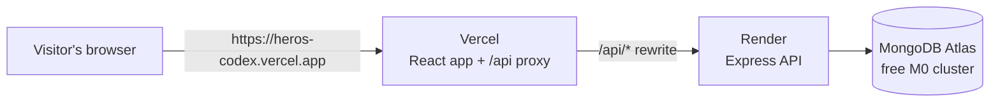

# Hosting Hero's Codex online

How to deploy Hero's Codex on free hosting tiers. The first deploy takes roughly an hour.

## The setup



| Part | Service | Cost | Notes |
|---|---|---|---|
| Web app | **Vercel** (Hobby) | Free | Serves the built React app and proxies `/api` to Render |
| API | **Render** (Free web service) | Free | Runs the Express API, configured by `render.yaml` |
| Database | **MongoDB Atlas** (M0) | Free | 512 MB, which is plenty for this app |
| Custom domain | Any registrar (optional) | ~£10/year | Only if you want e.g. `heroscodex.dev` |

The browser only talks to the Vercel address, and Vercel forwards `/api/*` requests to Render, so no CORS configuration is needed.

Render's free tier sleeps after 15 minutes without traffic, and the next request takes 30 to 60 seconds. The app shows a message while it waits. See [Cold starts](#cold-starts) for options.

> **There is no login.** Anyone who has the link can view, edit and delete every character. That is fine for a portfolio demo, but don't store anything you would mind losing, and see [Resetting the demo data](#resetting-the-demo-data).
>
> To stop one visitor flooding the database, each IP address can make 60 creates, edits or deletes every 15 minutes. Reads are not limited. Change this with `WRITE_RATE_LIMIT` on Render.

---

## Before you start

- [ ] Commit this work and merge it into `main` (Vercel and Render deploy from GitHub).
- [ ] Check the GitHub Actions **CI** run on `main` is green.
- [ ] Have somewhere secure to store the new database password.
- [ ] Don't reuse the old Atlas password that is in the repo's git history.

---

## Step 1: Database (MongoDB Atlas)

1. Sign up at <https://www.mongodb.com/cloud/atlas/register>.
2. **Create a cluster** → choose **M0 (Free)**. Provider **AWS**; region **Frankfurt (eu-central-1)** if you are in Europe, so it sits next to the API; otherwise the region closest to you. Name it `heros-codex`.
3. **Database Access** → *Add New Database User*
   - Authentication: password. Username: `heros-codex-api`.
   - Click **Autogenerate Secure Password** and save it somewhere secure.
   - Role: *Read and write to any database*.
4. **Network Access** → *Add IP Address* → **Allow access from anywhere** (`0.0.0.0/0`).
   Render's free tier has no fixed outgoing IP address, so this is required. Access still requires the generated password.
5. **Connect** → *Drivers* → copy the connection string. Replace `<password>` with the generated one, and add the database name before the `?`:

   ```
   mongodb+srv://heros-codex-api:<password>@heros-codex.xxxxx.mongodb.net/heros-codex?retryWrites=true&w=majority
   ```

   Keep this string private. It only ever goes into Render's dashboard, never into the repo.

## Step 2: API (Render)

1. Sign up at <https://render.com> with your GitHub account and allow access to the `dnd-character-project` repo.
2. **New → Blueprint** → select the repo. Render reads `render.yaml` and proposes a service named **heros-codex-api**.
3. Fill in the values it asks for:
   - `MONGODB_URI`: the Atlas string from Step 1.
   - `CORS_ORIGIN`: put `https://heros-codex.vercel.app` for now; you will confirm it in Step 4. (It's only used if something calls the API directly instead of through Vercel.)
4. **Apply**. The first build takes a few minutes. When it is live, open
   `https://heros-codex-api.onrender.com/api/health`: it should show `{"status":"ok"}`.
   - If Render gave the service a different URL (e.g. `heros-codex-api-ab12.onrender.com`), note it for Step 3.
   - If the deploy fails, open **Logs**: a `MONGODB_URI` or authentication error means the connection string or Atlas network access needs fixing.
5. Optional: add the sample characters by running this on your own computer, with `MONGODB_URI` in `backend/.env` set to the Atlas string:

   ```
   npm run seed -w backend
   ```

## Step 3: Web app (Vercel)

1. If your Render URL differs from `heros-codex-api.onrender.com`, edit `frontend/vercel.json` so the `/api/:path*` rewrite points to it, then commit and push.
2. Sign up at <https://vercel.com> with GitHub → **Add New… → Project** → import the repo.
3. Set **Root Directory** to `frontend`. Leave the framework and commands alone: `frontend/vercel.json` already sets them (it installs from the repo root so the shared package is included).
4. **Do not** set `VITE_API_URL`; the proxy makes it unnecessary.
5. **Deploy**. Vercel shows your URL, for example `https://heros-codex.vercel.app`. You can rename the project under *Settings → General* to get a nicer address.

## Step 4: Connect and check

1. If your Vercel URL is different from what you entered in Step 2, update `CORS_ORIGIN` on Render (*Environment* tab) and let it redeploy.
2. Open the Vercel URL in a private window and check:
   - [ ] The character list loads (the first request may take up to a minute while Render wakes).
   - [ ] **New sheet**: fill in a name, pick "Other" for the race and write one in, fill a few boxes, and **Save**.
   - [ ] Refresh the page: everything you wrote is still there.
   - [ ] Roll a skill with the d20 next to it, and roll dice in the tray.
   - [ ] **Print / PDF** shows a one-page sheet.
   - [ ] Delete the test character.
   - [ ] Opening `/characters/<id>` directly works (the SPA rewrite).
   - [ ] It works on your phone.

## Step 5: Add the link to the README and CV

- Put the live URL at the top of `README.md` (replace "Live demo: coming soon").
- On GitHub, set the repo's **About → Website** to the URL and add topics like `react`, `express`, `mongodb`, `dnd-5e`.
- On your CV, link both the live site and the repo.

---

## After launch

**Automatic deploys.** Pushing to `main` redeploys both Vercel and Render. Vercel also builds a preview for each pull request; previews use the production API and database.

**Cold starts.** Pick one:

| Option | Cost | Effect |
|---|---|---|
| Do nothing | Free | The first visit after idling waits 30 to 60 seconds |
| Uptime monitor pinging `/api/health` every 10 min (e.g. UptimeRobot) | Free | Keeps the API awake and emails you if it goes down; uses nearly all (~744) of Render's 750 free hours a month, so run only one always-on service |
| Render Starter instance | about $7/month | Always on |

**Monitoring.** Render → *Logs* for API errors, Vercel → *Logs* for the proxy, Atlas → *Alerts* for database health.

### Resetting the demo data

Because anyone with the link can change things, you may want to reset the characters before sending the link to someone. In Atlas, open **Browse Collections**, delete the `characters` collection, then run `npm run seed -w backend` from your computer with `MONGODB_URI` pointing at Atlas.

**Custom domain (optional).** Buy a domain, add it in Vercel → *Settings → Domains*, and follow the DNS instructions. Then add the new `https://` address to `CORS_ORIGIN` on Render (comma-separated).

## Security checklist

- [ ] The Atlas password exists only in Render's environment settings and your own secure storage.
- [ ] The password leaked in the old repo history is not used anywhere.
- [ ] The Atlas user has only read/write access (not *Atlas admin*).
- [ ] You're comfortable that visitors can edit the characters (there are no accounts).

## Troubleshooting

| Symptom | Likely cause | Fix |
|---|---|---|
| Every request fails with 404 on `/api/...` | Vercel rewrite points to the wrong Render URL | Fix the destination in `frontend/vercel.json`, push |
| "Cannot reach the server" on first visit | Render is waking up | Wait a minute and retry; consider an uptime monitor |
| Render logs show `MongoServerSelectionError` | Atlas network access or wrong password | Allow `0.0.0.0/0` in Atlas; re-copy the connection string |
| Every visitor gets "Too many changes" at once | `TRUST_PROXY` is wrong, so all visitors share one IP | Check `TRUST_PROXY` is `2` on Render; if it keeps happening, try `3` |
| Build fails on Vercel with "Cannot find module '@dnd/shared'" | Install ran inside `frontend` only | Keep the `installCommand` from `frontend/vercel.json`; Root Directory must be `frontend` |
